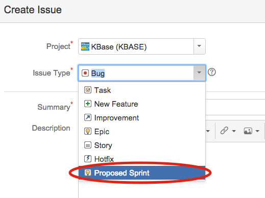

## Overview

In an Agile development process requirements and solutions evolve
through collaboration between cross-functional teams. It promotes
adaptive planning, evolutionary development, early delivery, continuous
improvement, and encourages rapid and flexible response to change. In
addition, it promotes ownership, accountability and transparency by
requiring all members to contribute and visibly communicating the
current priorities and progress on active priorities.

The KBase Executive Committee will prioritize Campaigns (one to two
month long development efforts for 3-5 people) that can be completed in
one or more Sprints (two weeks of effort for 3-5 people). KBase will run
2-week Sprint sessions with four teams. Each team would have 3-5
members. A Sprint team would have a product owner (the person
responsible for ensuring the product is done right as a whole); the
product owner could change from Sprint to Sprint based on what is being
targeted. The Sprint Teams may also change composition, but we would try
to avoid too much change since building up a strong functional team is
an important component of Agile.

A key principle of Agile is iterative improvement. This applies to the
process, as well as development. Consequently, the process should evolve
based on experience and feedback. The proposal below should be thought
of as a starting point that will be improved through an explicit
Retrospective process that improves after every 2 week Sprint cycle.

## Team Configurations

Fundamentally, co-localization supports high bandwidth discussion and
communication. However, because of the distributed nature of the KBase
project, we will have some teams with members that are from multiple
sites. We will aim for a balance. The team compositions can and will
change, but we will aim for continuity as much as possible since this
helps build familiarity and camaraderie. The LRM (Fernando Perez) and
Production Lead (Shane Canon) will be responsible for balancing team
composition before each Sprint.

Members of a Sprint should be working on the Sprint tasks for at least
60% time during the Sprint window (i.e. 6/10 days) and available for
discussion throughout. Staff that are at fractional effort or have a
small amount of effort allocated to “Sprint-able” Teams should
consolidate time and communicate when they will be available.

Product Owners may be chosen from outside the Production boxes, for
example, when a person has a firm understanding of what needs to be
delivered for a specific item.

As described below, each sprint will start with a team meeting to decide
on scoping, roles and task breakdown. Each sprint team will have a
designated representative that attends a Sprint Oversight meeting. These
will occur one to two times a week and are meant to identify any
conflicts between Sprint teams. However, it is likely that the
Production Lead and LRM will attempt to select Sprints such that the
tasks are non-overlapping/interacting.

Depending on the sprint goals, we will experiment with having members of
the UE documentation team be part of the sprint teams to help create
documentation and tutorials.

### Non-Sprint Personnel

Some team members posses critical science knowledge. These members may
be assigned to specific teams or designated as product owners when a
deliverable aligns with their expertise. For KBase developers who are
very low percent effort, or are otherwise unable to join a Sprint, they
will coordinate with their box lead to identify tasks.

## Sprint Cycle

We will use a two week Sprint Cycle. At first we will include a one week
period between each Sprint or every two Sprints to capture cleanup
items, maintenance, and other tasks that don’t neatly fit into a Sprint
model. Over time we will try to reduce these.

-   Each Sprint will start with a two hour planning meeting with the
    Product Owner and Team members (described below).

-   Each Sprint Team should have a short (15 minutes) daily meeting to
    cover what was done the previous day, what is on deck for that day,
    and any critical blockers.

-   The Sprints will end with a Retrospective. This will be used to
    assess how much of the Campaign the Sprint accomplished, remaining
    or incomplete items will return to the Campaigns backlog. New items
    that come up during the Sprint will also be added to the backlog.
    The Retrospective will also be used to discuss any lessons learned
    during the Sprint and suggest changes.

<table>
<tbody>
<tr class="odd">
<td align="left"></td>
<td align="left">Monday</td>
<td align="left">Tuesday</td>
<td align="left">Wednesday</td>
<td align="left">Thursday</td>
<td align="left">Friday</td>
</tr>
<tr class="even">
<td align="left">Week 1</td>
<td align="left">Planning Meeting</td>
<td align="left">Daily</td>
<td align="left">Daily</td>
<td align="left">Daily</td>
<td align="left">Daily</td>
</tr>
<tr class="odd">
<td align="left">Week 2</td>
<td align="left">Daily</td>
<td align="left">Daily</td>
<td align="left">Daily</td>
<td align="left">Daily</td>
<td align="left">
Sprint

Retrospective
</td>
</tr>
<tr class="even">
<td align="left">
Week 3

[maintenance &amp; steady state activities]
</td>
<td align="left">Report out to all@kbase</td>
<td align="left">E.C. evaluation</td>
<td align="left">E.C. reprioritization</td>
<td align="left">Team and Product Owner assignments</td>
<td align="left"></td>
</tr>
</tbody>
</table>

## Deliverables: Sprints and Campaigns

Deliverables will be split into Sprints and Campaigns. A deliverable
(Sprint or Campaign) should result in a complete “product” that,
usually, results in a user visible item (i.e. a new feature or
component). However, some items may be more internal (i.e. architecture
changes, refactoring). For deliverables that are too big for a Sprint,
they will be organized in Campaigns which can include multiple Sprints.
However, Campaigns shouldn’t exceed four Sprints. This is to avoid
having deliverables that take too long to provide a finished product
which delays feedback.

Problems that require long-term thinking and effort, such as the repayment of
technical debt, architectural evolution or the replacement of a major
component, should still be able to break down the long-term problem into
campaigns and then further into sprints.  This encourages a focus of these
efforts into cycles where concrete feedback and outcomes can be attained.

## Priority List (Product Backlog)

The project will maintain a global publicly visible priority list of
deliverables. This list will be maintained by the EC with input from the
Production Leads, Science Engagement, and User Engagement. This list is
a living document that will be updated periodically both to reflect
completed work but also changing priorities. Prior to each Sprint, the
Production Leads and LRM will determine which major Sprints or Campaigns
will be tackled during the next Sprint cycle. This selection will be
shared with the entire project. In general, the highest priorities will
be selected, but conflicts, resource balancing or critical maintenance
items may influence the selection. Deferring an item shouldn’t be
problematic since the item will likely get prioritized in subsequent
sprints.

## Coordination with Science Engagement

The Science Engagement team will also participate in the Sprint process.
After some initial prototyping is done with the selected collaborators,
the collaboration lead will write a campaign doc and submit it to the
E.C. for scheduling/prioritization. These campaigns can be for hardening
the prototype services, data models and visualizations and pushing the
functionality out to the live site. There may also be some situations
where SE will need sprints to create the initial prototypes.

## Coordination with User Engagement

User Engagement will also be able to create Sprints and Campaigns. There
will be situations where UE, based on feedback from users or upcoming
outreach events, will initiate campaigns around tutorials or user
requested functionality. For example, based on user feedback, UE may
determine that by adding a new narrative tree algorithm we could capture
a significant number of new users. They would write up a Campaign and
submit it to the EC. In another case, UE may determine that they need
new material for an upcoming workshop, and this would be a Sprint
requiring effort from developers and scientists working with the UE.

## Coordination with Release Engineering

We expect that most Sprints will create deployable functionality that
will be immediately deployed on CI and next.kbase.us and will eventually
move to production in a rapid time-frame (weeks). Some Campaigns may
have more disruptive changes (e.g., format changes) that require more
significant deployment; those migration and deployment activities should
be integrated into the Campaign and include Sprints to address those
changes.

## Pre-Sprint Planning

After a campaign is selected, the product owner will meet with the
sprint team to plan the sprint. During this process, the sprint team and
product owner will generate user stories, discuss what the deliverables
of each user story entails and select a set of stories to complete
during the sprint. At this point, each user story will be broken down
into tasks. The user stories can then be shared with the project and
individual tasks can be added to JIRA for tracking.

The sprint-planning team will be responsible for evaluating each task in
the context of KBase wide integration to prevent redundancy, silos and
inconsistencies.

## Coordination between Sprint Teams and Box Leads

For Sprints that directly impact areas controlled by a box lead, we
expect that the Sprint team will include the box lead and/or members of
that box. Once or twice a week, there will be a Sprint Oversight
meeting. During this meeting the selected representative from each
Sprint will meet with the Production Lead, LRM and Box Leads. At this
meeting both direct and indirect impacts on Box Areas will be discussed
and activity from the Sprints can be reviewed to ensure that design and
implementation choices align with the broader project principles and
goals.

## Reporting and Tracking

The priority list is
[maintained and publicly visible here](https://docs.google.com/spreadsheets/d/1RYqniwN816QkaJqRJgsHXqkuIkFZ3S90dVD0RjR4jxk/edit?usp=sharing). As
Campaigns are selected for a Sprint Cycle and the planning is completed, the
team will create and assign JIRA tickets to track tasks, and below we describe
the process for proposing new sprints and campaigns.

At the end of each Sprint, the teams will create a formal summary and present
the results of their Retrospective on the Monday Report Out Meeting (this
summary should be linked into the original Sprint issue that was created when
the Sprint was approved). These results may also include lessons learned for
improving future Sprints. Each Sprint team will have a half an hour for
presentation and discussion. All KBase personnel are invited to attend.  These
reports can then be used for creating progress reports to DOE.

## Management

The primary role of the EC and PIs will be to maintain the
prioritization list and provide feedback to the Production Lead and LRM.
The Production Lead and LRM are responsible for sequencing Sprints and
managing the Sprint Teams. The EC and PI will have opportunities to
adjust the priorities during the Sprint-Free week and quarterly Project
Planning Meetings.

We can also allocate fixed number of sprints per cycle for specific
areas. For instance, management may determine that there should always
be a UI campaign.

## Process for proposing new sprints or campaigns

To propose a new sprint, the process to follow is:

1. Open a new issue on JIRA, and assign to it the issue type "Proposed Sprint"
   (we don't have a separate type for sprints and campaigns):

2. Provide in the *Summary* field a one sentece description of the sprint.

2. Fill out the *Description* field with a body of text according to the
   template in the section immediately below.  It should be relatively concise,
   but try to answer each of these questions clearly, so that the group leads
   and KBase executive committee can use this information to decide whether to
   accept your proposal and put it into the sprint pipeline.

2. Assign it to Shane Canon, the production lead.

2. List any components you may think it impacts, if you know in advance. 

2. At this time, don't bother adding Epic/Theme or Sprint labels yet, as those
   will be added if the sprint is actually accepted for execution later on.

### Template

**Why it’s important:** Explain why KBase should do this.  How will it
help make KBase unique, bring in users, improve the system, etc.  Why is
it more important for KBase to do this compared to other priorities.

**What needs to be done?** Provide a brief paragraph describing what has
to be done including new data types, new UI pieces, example, etc.  Be
complete but avoid going into implementation details.  This is more
about understanding the scope of the activity versus exactly how it will
be done.

**Estimated Number of Sprints:** X sprints

**Key Staff:** List important staff needed for the Sprint and what
specific skills and knowledge they provide.

**Dependencies:**  List any other campaigns, sprints, or activities
that impact your proposed sprint or campaign.

### Evaluation of sprint proposals

Once a sprint/campaign proposal is submitted, there may be discussion and
questions about it directly on the JIRA ticket.  The members of the KBase
Executive Committee, who ultimately will make the decisions on which sprints to
put into the implementation pipeline, will be added as watchers to the ticket
so they have a chance to comment.

Then, during the next maintenance week, the EC will include in its evaluation
and re-prioritization decisions (that normally consider the outcome of the
just-finished sprint cycle) any new proposals that have arrived.  This will
allow the EC to weigh these proposals in the context of the outcomes and
feedback of the recently concluded sprint cycle.

The EC can decide to assign the proposals either to immediate execution in the
next cycle, to be put in the queue for a later cycle, or it can decline the
proposal.

If a proposal is accepted, it will be given a sprint label and an epic/theme in
JIRA so it can be sorted accordingly, and it will be re-assigned to its
ultimate product owner.

If a proposal is rejected, the rejection type will be one of:

* *Reject*: As written, this proposal is not going to happen, and the reasons
  why will be communicated.
* *Reconsider*: We foresee doing this, but it needs to wait for N sprint cycles
  to be re-evaluated.  The resolution should specify what is blocking and how
  many cycles to wait before resubmission (point at which, there may be new
  information to consider).
* *Not discussed*: We didn't get around to talking about it; we will get to it
  next time.  This is not ideal, but realistically it will happen sometimes.

This information will be recorded in the proposal ticket, so the submitter will
have a record of the decision.

# Remaining questions

These are a few questions that arose in the previous PR regarding how the Agile
development process and decisions are made.  We should at least clarify some of
them:

* A request for more transparency from EC on decision process: agenda and
  outcomes, as they pertain to the development process, should be shared with
  the team.
 
* How is work outside of the sprint cycles reported, managed, or decided on? 

* Does the Executive committee review work that is not part of the sprint
  cycles? 

* How do the working teams get a finer-granularity and updated description of
  priorities and project vision? This seems critically necessary to have clear
  objectives and goals that to plan against.  Basically, a dynamic, living
  version of the project high-level roadmap that is updated periodically by the
  EC.

