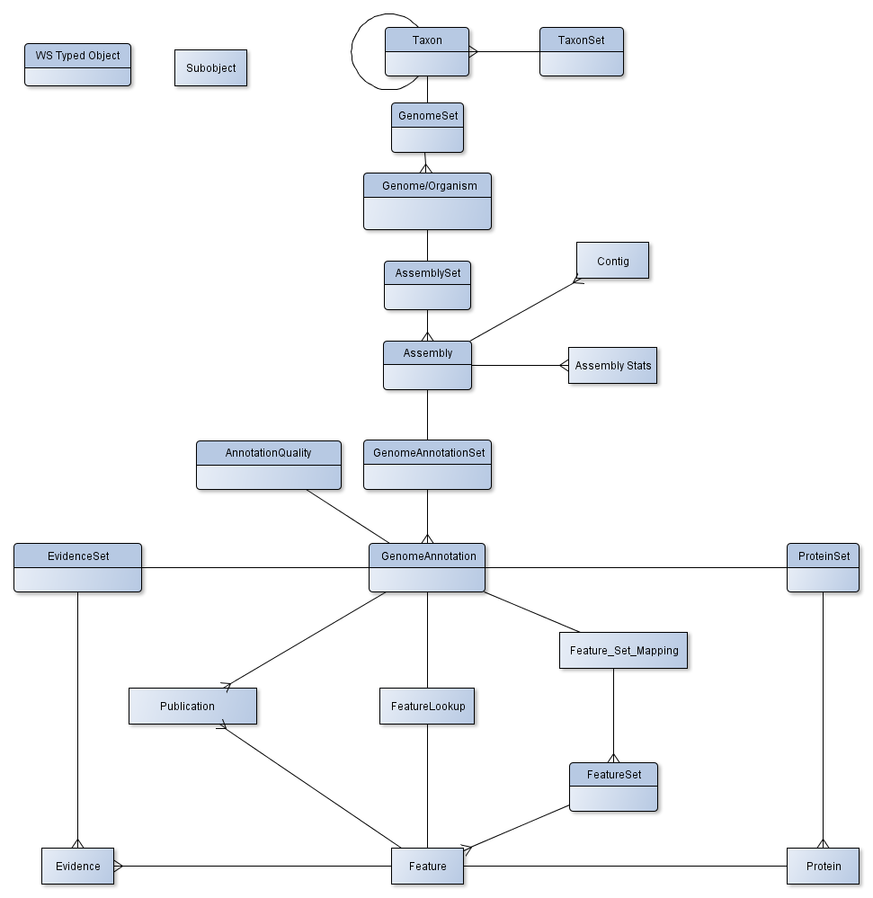

#Eukaryotic Genome – Multilayered

**This was designed to optimize across the following factors**

**Accuracy:** Accurately reflecting the data structure and its relationships.

**Functionality:** Allowing people to access the data they need to (both for reporting and passing into functions). Being able to reasonably cross cut the data in the primary ways needed.

**Speed:** Allowing reasonably fast access to the data

**Storage:** Where it limits the entities stored to reasonable sizes within the workspace constraints.

**The major constraints affecting my design choices are the 1 GB typed object size limit of the workspace and the fact that the workspace can only do relationships in one direction since it was designed as a DAG.**

**NOTE: This is for the multilayered approach to Genome. This is a more accurate representation of the entities involved, although it has some overhead in terms of versioning of the objects and search issues on the levels people are actually searching. The search genome blows up as it can be many annotations.**

-------------------

##ER Diagram:

##Spec:
--------------------------
**“\*” fields are required.**

**Structures name in bold would be WS Typed Objects**

We are introducing a new concept of an nonversioned Workspace reference.
So currently a Workspace reference contains 3 numbers spearated by a slash.
The first number is the Workspace ID.  The second number is the Workspace Object ID.  The last number is Workspace Object Version number.

An nonversioned workspace reference would only contain Workspace ID and Workspace Object ID.

This prevents version creep from cascading up when descendent objects get updated.

However this would require the workspace enforce that an workspace object can not change workspace typed objects.
Currently a I could create an object of type "A" named foo.  If I save an object of type "B" named foo it increments the version number of the object and the object has completely changed types.
It should however allow for a new version of the typed object (ex: Genome1.0 to Genome2.0)

###Taxon

typedef structure {
* string taxonomy_id\*;
* string scientific_name\*;
* string scientific_lineage;
* string domain\*;
* list\<string\> aliases;
* int genetic_code;
* string reference_genome_id;
* string genome_set_ref; 
* string parent_taxon_ref;
* string taxon_set_ref;

} **Taxon**;

Note both references are nonversioned WS object reference.

genome_set_ref is a nonversioned WS object reference.

taxon_set_ref is a nonversioned WS object reference.

parent_taxon_ref is a versioned WS object reference.

reference_genome_id is a key in the genome_set, thus it requires a genome_set_ref to exist.
This could potentially be made to direct reference to the object instead.

---------------------------

###TaxonSet

typedef structure {

* string taxon_set_id\*;
* string name;
* string description;
* string notes;
* mapping\<string taxonomy_id, string taxon_ref\>;

} **TaxonSet**

Note the reference is a nonversioned WS object reference.

---------------------------

###GenomeSet

typedef structure {

* string genome_set_id\*;
* string name;
* string description;
* string notes;
* mapping\<string genome\_id, string genome_ref\>;

} **GenomeSet**

Note the reference is a nonversioned WS object reference.

--------------------------

###Genome

typedef structure {

* string genome\_id\*;
* string external\_source;
* string external\_source\_id;
* string external\_source origination\_date;
* string reference\_assembly\_idf; 
* string notes;
* string environmental\_comments; 
* string taxon\_ref;
* string assembly_set_ref;

} **Genome**; 

Should object be called organism or strain name instead?

Taxon ref is a versioned WS object reference.

reference_assembly_id is a key in the genome_set, thus it requires a assembly_set_ref to exist.
This could potentially be made to direct reference to the object instead.

location and environment information (perhaps separate fields for latitude, longitude, altitude)(perhaps we need a MixS object)

-------------------------

###AssemblySet

typedef structure {
* string assembly_set_id\*;
* string name;
* string description;
* string notes;
* mapping\<string assembly_id, string assembly_ref>;

} **AssemblySet**

Note the reference is a nonversioned WS object reference.

--------------------------

###Assembly

typedef structure {
* string assembly_id\*;
* string name;
* string md5\*;
* string external_source;
* string external_source_id;
* string external_source origination_date;
* float gc_content;
* string type;
* reads_handle_ref reads_handle_ref; 
* fasta_handle_ref fasta_handle_ref\*; 
* mapping\<string contig_id, Contig\> contigs\*;
* assembly_stats assembly_stats;
* int is_reference; 
* string reference_genome_annotation_id; 
* int dna_size;
* int num_contigs;
* string genome_annotation_set_ref;
* string comments;
* string genome_ref;

} **Assembly**;

Type is a controlled vocabulary.  Example Finished, Draft.

is_reference - 1 is reference assembly for the genome/strain, 0 is non reference

reference_genome_annotation_id is a key in the genome_set, thus it requires a genome_annotations_set_ref to exist.
This could potentially be made to direct reference to the object instead.

genome_ref is a versioned workspace object reference.

-----------------------

####Contig

typedef structure {
* string contig_id\*;
* int length\*;
* string md5\*;
* string name;
* string description;
* int is_complete; 
* string is_circular\*; 
* int start_position;
* int num_bytes;

} contig;

is_complete - is an indication of complete chromosome, plasmid, etc.

is_circular - True, False and Unknown are viable values, could make an int(bool). If field not present viewed as unknown.

----------------------

####assembly_stats

typedef structure {

\#FangFang and others should help us spec this out

\#include assembler, sequencing tech, etc?

} assembly\_stats; 

Separate object or contained in the assembly?

-------------------------

###GenomeAnnotationSet

typedef structure {
* string genome_annotation_set_id\*;
* string name;
* string description;
* string notes;
* mapping\<string genome_annotation_id, string genome_annotation_ref>;

} **GenomeAnnotationSet**

Note the reference is a nonversioned WS object reference.

-----------------------
###GenomeAnnoation

typdef structure {
* string genome_annotation_id\*;
* int reference;
* float quality_score; 
* string annotation_quality_detail_ref; 
* list\<publication\> publications;
* feature_sets_map feature_set_references\*;
* string protein_set_ref;
* string evidence_set_ref;
* feature_lookup feature_lookup\*;
* string comments;
* string methodology; 
* string assembly_ref;

} **GenomeAnnotation**;

quality_score could be in genome_annotation_quality_detail instead

annotation_quality_detail_ref would be a versioned workspace reference 

evidence_set_ref would be a nonversioned workspace reference 

protein_set_ref would be a nonversioned workspace reference 

methodology - Not sure if needed? example would be rast

assembly_ref would be a versioned workspace reference 

----

####FeatureLookup

typedef structure{
* mapping\<string feature_key\*, list\<tuple\<string feature_set_ref, string feature_id\>\> lookups\*\> feature_lookups;

} FeatureLookup;

note feature key could be id or alias. Allows for fast lookup of any feature by id or alias.

----------------------

####feature_set_map

mapping\<feature_type\*, feature_set_ref\*\> feature_set_map;

This would be an nonversioned workspace reference;

The feature type is a controlled vocabulary perhaps derived from [*http://www.insdc.org/files/feature_table.html#7.2*](http://www.insdc.org/files/feature_table.html#7.2)

------------------------

###AnnotationQuality

typedef structure {
* float metadata\_completeness\*; 
* list\<string\> metadata\_completeness\_warnings\*;
* float data\_quality; 
* list\<string\> data\_quality\_warnings; 
* int feature\_types\_present\*; 
* int evidence\_supported\*; 
* string genome_annotation_ref;

} **AnnotationQuality**;

genome_annotation_ref would be an nonversioned workspace reference - Maybe reference not needed.

-----------------------------

###FeatureSet

typedef structure {
* string feature_set_id\*;
* string type\*; 
* string name;
* string description;
* string notes;
* mapping\<string feature_id, feature feature>;

} **FeatureSet**

type would be controlled vocabulary - Ex: CDS, etc.

Note this structure allows for flexible sets.  So type may not be required or a "mixed" type may need to be introduced into the controlled vocabulary.

-----------------------

####Feature

typedef structure {
* string feature\_id\*;
* list\<tuple\<string assembly\_ref, string contig\_id, int start, string strand, int length\>\> locations\*;
* string type\*;
* string function;
* string md5\*;
* string dna_sequence\*;
* int dna_sequence\_length\*;
* list\<publication\> publications;
* list\<string\> aliases;
* string notes;
* string comments;
* string inference; 
* float feature\_quality; 
* list\<string quality_warnings\>; 
* \<tuple\<string annotation_evidences\_ref, list\< string evidence_id\>\>\> evidences ;
* CDS_properties CDS_properties;
* mRNA_properties mRNA_properties;
* gene_properties gene_properties;
* operon_properties operon_properties;
* pathway_properties pathway_properties;

} Feature;

inference - Genbank has an inference tag within a feature.

#####Feature Questions.

For quality_warnings do we want severity (warnings, errors)?

Do all features have coordinates? Shuffleons do and do not Genbank has a mobile\_element\_type feature type.
Do we want to try and capture motifs. Orthologs? Orthologs get a little tricky in terms of multiple annotations for the same genome/taxonomy.

These were part of the old feature object.  I have not included them in this incarnation.
We would need to have discussions about them.

/*
list\<annotation\> annotations; 
does this include ontologies? Ontologies;probably a list to ontology terms or even WS objects. Details can be worked out later

list\<subsystem\_data\> subsystem\_data;

list\<string\> subsystems;

list\<ProteinFamily\> protein\_families;

list\<tuple\<string, float\>\> orthologs; \# probably belongs on its own

list\<regulon\_data\> regulon\_data;

list\<atomic\_regulon\> atomic\_regulons;

list\<coexpressed\_fid\> coexpressed\_fids;
*/

-------------------------------
####Feature Properties

Below are Feature properties for specific type of features.

The references for the feature properties would all be nonversioned Workspace references.

This is the initial thinking of specific types that might need special properties, but more could be easily added in the future.

typedef structure{
* \<tuple\<string protein_set_ref, string protein_id\>\> codes_for_protein_ref;
* string EC_Number;
* \<tuple\<string feature_set_ref, string feature_id\>\> associated_mRNA_ref;
* \<tuple\<string feature_set_ref, string feature_id\>\> parent_gene_ref;
* \<tuple\<string feature_set_ref, string feature_id\>\> operon_ref;
* \<tuple\<string feature_set_ref, string feature_id\>\> pathway_ref;

} CDS_properties;

typedef structure{
* \<tuple\<string protein_set_ref, string protein_id\>\> codes_for_protein_ref;
* \<tuple\<string feature_set_ref, string feature_id\>\> associated_CDS_ref;
* \<tuple\<string feature_set_ref, string feature_id\>\> parent_gene_ref;
* \<tuple\<string feature_set_ref, string feature_id\>\> operon_ref;
* \<tuple\<string feature_set_ref, string feature_id\>\> pathway_ref;

} mRNA_properties;

typedef structure{
* \<tuple\<string protein_set_ref, string protein_id\> codes_for_protein_ref;
* \<list\<tuple\<string feature_set_ref, string feature_id\>\> children_CDS_ref;
* \<list\<tuple\<string feature_set_ref, string feature_id\>\> children_mRNA_ref;
* \<tuple\<string feature_set_ref, string feature_id\> operon_ref;
* \<tuple\<string feature_set_ref, string feature_id\> pathway_ref;

} gene_properties;

Gene, CDS mRNA could be part of more than one pathway?  Make it a list?

typedef structure{
* \<list\<tuple\<string protein_set_ref, string protein_id\>\> protein_refs;
* \<list\<tuple\<string feature_set_ref, string feature_id\>\> component_CDS_ref;
* \<list\<tuple\<string feature_set_ref, string feature_id\>\> component_mRNA_ref;
* \<tuple\<string feature_set_ref, string feature_id\>\> pathway_ref;

} operon_properties;

Note order matters in the lists.  Suggests ordinal position along operon.

Note this pattern 

\<list\<tuple\<string feature_set_ref, string feature_id\>\> component_CDS_ref;

could be rewritten as below if all the CDS features are in the same feature set (which should be the case).

\<tuple\<string feature_set_ref, \<list\<string feature_id\>\> component_CDS_ref;

typedef structure{
* \<list\<tuple\<string protein_set_ref, string protein_id\>\> protein_refs;
* \<list\<tuple\<string feature_set_ref, string feature_id\>\> component_CDS_ref;
* \<list\tuple\<string feature_set_ref, string feature_id\>\> component_mRNA_ref;

} pathway_properties;

Note order matters in the lists. 

------------------------------------------

###ProteinSet

typedef structure {
* string protein_set_id\*;
* string name;
* string description;
* string notes;
* mapping\<string protein_id, protein protein>;

} **ProteinSet**

---------------

####Protein

typedef structure {
* string protein_id\*;
* mapping\<string domain, \<list\<list\<tuple\<int coordinate_start, int coordinate_stop\>\>\>\>\>; 
* string amino_acid_sequence\*;
* string function;
* list\<string alias\> aliases;

}protein;

Note the following:

mapping\<string domain, \<list\<list\<tuple\<int coordinate\_start, int coordinate\_stop\>\>\>\>\>; 

The outer list is for multiple of the same domain in the same protein.

The inner list is to accomodate domains that are noncontinuous sequence.

What about the following?
INTERACTIONS? ACTIVE SITE? ALLOSTERIC SITE? Folding pattern?

------------------------

###EvidenceSet

typedef structure {
* string evidence_set_id\*;
* string name;
* string description;
* string notes;
* mapping\<string evidence_id, evidence evidence>;

} **EvidenceSet**

----------------------

####Evidence

typedef structure {
* string evidence\_id\*;
* string description\*;
* string evidence\_type\*; \#structural or functional?
* list\<ws\_refs\> supporting\_objects;\#Generic WS reference, not to a specific typed object.

} evidence;

------------------------

####Publication

/*
Structure for a publication (from ER API)
also want to capture authors, journal name (not in ER)
*/
typedef tuple<int, string, string, string, string, string, string> publication;

This may need to get reworked.  This is directly from existing specs.  Unfortunately it currently is poorly documentated.

--------------------------------

Other questions to explore.

Look up features by contig chunk (get all features in that contig chunk?)

What about reannotation, annotation corrections. How do we want to capture. Is versioning enough or do we show active and inactive, corrected?

How to deal with ontologies.

##Assessment:
###Cons to approach
* Some redundancies of data to allow for different cross sectioning of the data.
* Many objects. Although some could be hidden.
* The introduction of the nonversioned WS refernce avoids the versioning cascade problem.  However you do not have a clear snapshot of an object if it has nonversioned WS references. Potentially this could be overcome by using the provenance to piece together a snapshot.

###Pros to approach
* Can cross section data.
* Better access
* Faster access
* More modular (thus allowing for smaller chunks of data to be moved around the system and passed into services)
* Reasonably sized objects.
* Workaround to the DAG limitation.
