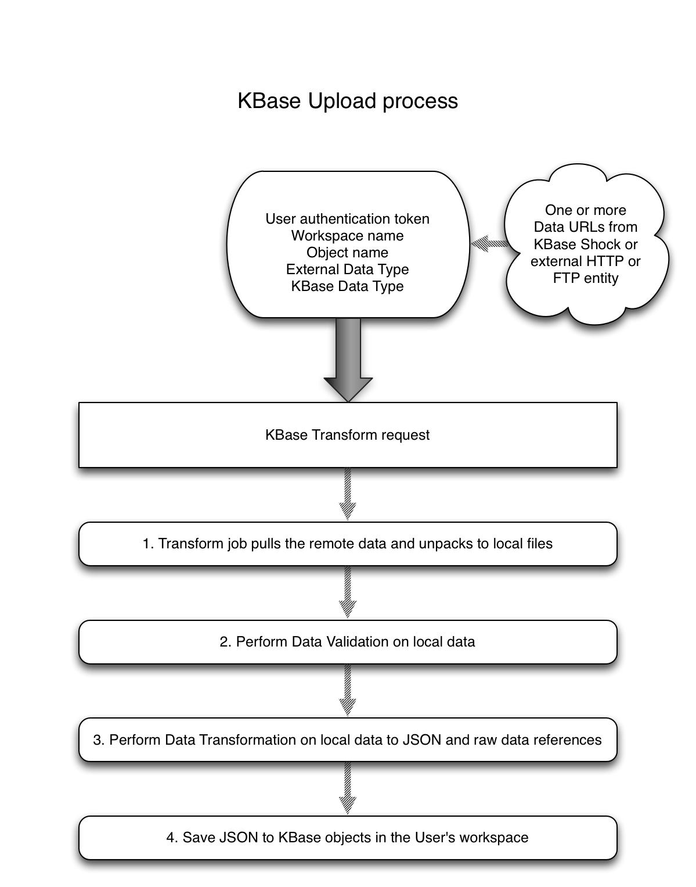
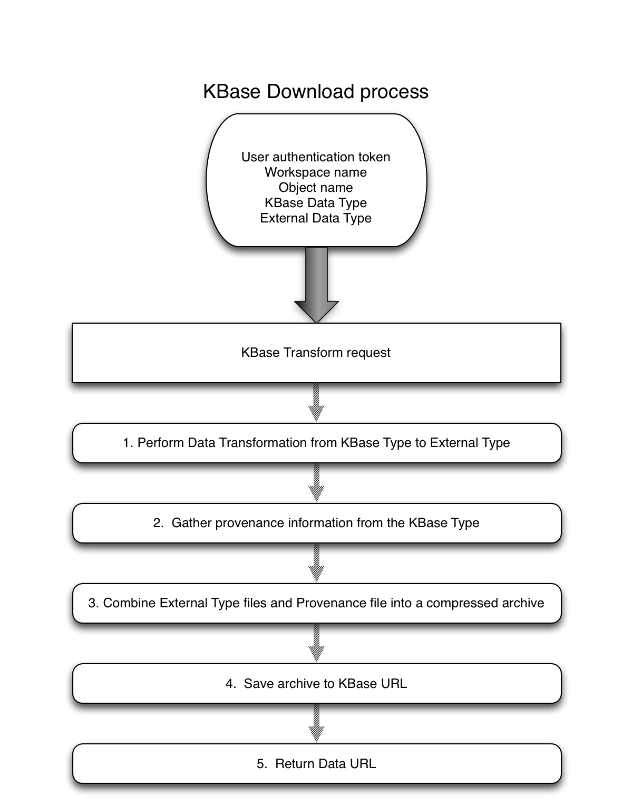

# How to add a new data type to KBase

1.  First you must submit documentation about what your data type would be used for, and how it fits into KBase. **You** *must* **wait for approval of this documentation before proceeding to step 2.** This documentation should include at a minimum:

    1.  A diagram that shows the biological concepts that your data describes, and how it relates to other biological concepts in KBase. This diagram should not be tied to a specific implementation of the data storage of the type.

    2.  A document that describes in detail all elements of the diagram, what each entity is, why it is important, what it describes/contains and why and what the relationships mean and why they are important. You should include known applications (use cases) that use this data type, showing how it is used and why.

2.  You need to create a KBase typespec document that describe the implementation of your data type. This should be well documented to describe the implementation details of your type and how they relate to the conceptual model described by your conceptual diagram and documentation.

    1.  See KIDL/KBaseAPIDescriptionLanguageKIDL.pdf for a description of the possible entries for a type.

    2.  For a simple spec file, please review KIDL/basic\_example.spec. Also see KIDL/KBaseNarrative.spec and KIDL/KBaseAssembly.spec for examples of existing KBase spec files used for defining types.

3.  Register your data type with the workspace using your typespec document.

> **Workspace Typed Object Definition & Registration**
>
> The process for adding new data types to the Workspace (which will make them available within the Narrative interface and usable as inputs/outputs of Narrative methods) is well documented here: [*https://docs.google.com/document/d/1cFaSLxtW7QfsIhlreRko\_AE\_nRoLJ26YhtAbIABEYhY/edit?usp=sharing*](https://docs.google.com/document/d/1cFaSLxtW7QfsIhlreRko_AE_nRoLJ26YhtAbIABEYhY/edit?usp=sharing)
>
> Before you do so, however, you should take time to understand how the Workspace operates and read over tips on how to design Workspace data types:
>
> [*https://docs.google.com/document/d/1PTxAfvoqUeVpz9HNadv5JV1d6gy\_8ZiBRPEyiJm48Jo/edit?usp=sharing*](https://docs.google.com/document/d/1PTxAfvoqUeVpz9HNadv5JV1d6gy_8ZiBRPEyiJm48Jo/edit?usp=sharing)
>
> If your data type cannot be defined completely as a hierarchical data type (e.g., you need to include a FASTA file), you still absolutely need a Workspace data type, but you can use handles in your workspace data objects to reference files stored in Shock. Note that unlike workspace data, files in Shock are not managed by the Workspace, so can be deleted by anyone with write access to the data at any time, making your handles invalid. In all code that uses such types, therefore, you should deal with that case appropriately. A guide for dealing with handles in Workspace data objects can be found here:
>
> [*https://docs.google.com/document/d/1GewweS2KkP5IREdRBMcsmEuOMv-HURFeaob20twNmC4/edit?usp=sharing*](https://docs.google.com/document/d/1GewweS2KkP5IREdRBMcsmEuOMv-HURFeaob20twNmC4/edit?usp=sharing)

1.  Code and documentation for uploading and downloading your data type in any formats other than the Workspace object JSON.

> **Upload / Download Support**
>
> **4.1** Create a github fork of the “develop” branch of [*https://github.com/kbase/transform*](https://github.com/kbase/transform/tree/develop)

**Directory structure**

/lib - service server and client code, shared common library code for python and perl scripts

/plugins - all configs and scripts used for upload/download/validate steps

> /scripts - all scripts run by the transform service job
>
> /validate - all scripts for data validation used when uploading
>
> /upload - all scripts used to transform data for uploading
>
> /download - all scripts used to transform data for downloading
>
> /convert - all scripts used to transform KBase data between KBase types
>
> /taskrunners - all job control scripts used to orchestrate upload/download/convert jobs

/configs - currently a flat directory with configs for all script types (will be broken down into categories like scripts)

/examples - meant for complete but trivial examples of each script type

/templates - meant for holding script templates for each type

/service - service configuration templates

/src - source code that needs to be compiled, java or c/c++ or other compiled language

/t - all tests

/deps - dependency libraries or binary deployment scripts for 3rd party dependencies (e.g., 3rd party validation code)

/bin - compiled ELF binaries

> Service methods and example calls:
>
> Upload:
>
> Download:
>
> Convert:

**4.2** For upload support (also see further down how upload works and details of config files and scripts):

> You should have a separate validate and transform script for the upload conversion. The validation step ensures that the source data is of the right format for transformation and performs any reasonable sanity checks on the data to ensure that it can be successfully transformed. The transformation step performs a data conversion from the source format to one or more KBase objects; however this conversion is always from one type to another type, meaning it is not for bulk or batch uploading of the same type of data. As a complete example, for converting from a DNA assembly to a KBase ContigSet (upload), and the reverse (download), we created the following files:
>
> **plugins/configs/FASTA.DNA.Assembly.json** (validate config)
>
> **plugins/configs/FASTA.DNA.Assembly\_to\_KBaseGenomes.ContigSet.json** (upload config)
>
> **plugins/configs/KBaseGenomes.ContigSet\_to\_FASTA.DNA.Assembly.json** (download config)
>
> **plugins/scripts/validate/trns\_validate\_FASTA\_DNA.py** (reusable by other FASTA validations)
>
> **plugins/scripts/upload/trns\_transform\_FASTA\_DNA\_Assembly\_to\_KBaseGenomes\_ContigSet.py**
>
> **plugins/scripts/download/trns\_transform\_KBaseGenomes\_ContigSet\_to\_FASTA\_DNA\_Assembly.py**

1.  Create and independently test a validation script under plugins/scripts/validate, with a configuration file under plugins/configs for validating each of the data formats (one script per format type) you want to support if KBase does not already support that format. If we do support that format, you can augment the existing KBase code or if your needs are different than support for other types you can create a separate validator and submit a pull request (PR) against the develop branch. See below for how the upload process works, but any data you need to work with will be supplied to you as local files, so you don’t need to consider network downloads or other aspects outside of validation. A reasonable example script to look at is plugins/scripts/validate/trns\_validate\_FASTA\_DNA.py, with corresponding config file at plugins/configs/FASTA.DNA.Assembly.json.

2.  Create and independently test a transformation script under plugins/scripts/upload, with a configuration file under plugins/configs, for transforming each of the data formats (one script per format type) you want to support if KBase does not already support that format. If we do support that format, you can augment the existing KBase code or if your needs are different than support for other types you can create a separate transformation script and submit a pull request (PR) against the develop branch. Similarly to validation, all input data will be provided to you as local files, and your output should be KBase object JSON unless you have special needs and require saving the object information yourself, which we do support if needed. Similarly if there are special circumstances requiring you to handle data validation simultaneously with transformation, we can support that, but you should discuss that with us before submitting a PR to save yourself potentially extra work. An example script and config to look at for an example would be plugins/scripts/upload/FASTA\_DNA\_Assembly\_to\_KBaseGenomes\_ContigSet.py, and plugins/configs/FASTA.DNA.Assembly\_to\_KBaseGenomes.ContigSet.json

**4.3** For download support (also see further down how download works and details about the config file and script):

> Download support is meant to be from a single KBase Type to an external format. In some cases that may mean you need to combine multiple objects in order to build the external file format, but this is not meant to be the method used for downloading bulk quantities of data from KBase. By default, KBase supports download of your data as raw JSON if you do not define a download format, but you are strongly encouraged to find or define a community format for your data that you will support. If no such format exists and you are not sure what to do, please discuss with us and we can help you define such a format for community use.

1.  Create and independently test a script for transforming from the KBase type, which can include one or more objects, to the external format you wish to support for download. Create a separate script for each format you wish to support and save under plugins/scripts/download and a config file under plugins/configs. The script is responsible for pulling the KBase Type information and creating the external format files. Provenance information, archive and compression, etc, are handled by the KBase Transform code and should not be implemented for each format conversion.

How data upload works: 

How data download works:

**External type names vs. KBase type names**

> KBase type names correspond to the KBase Workspace module name and type name linked above under Workspace Typed Object Definition and Registration. An example would be KBaseGenomes.Genome. In a config file, we use that exact string representation, and in a file name for a script, “.” is replaced by “\_”.
>
> External type names are context specific and should be clearly specified and based on the external file format available. For example, if your data is an FBA model, and the format is Excel, then the external type name is Excel.FBAModel. The template is \<external format name\>.\<context\>, where context could further be broken down, such as DNA.Reads or DNA.Assembly, etc. The context should be clear and distinguishable from other data.

**Config file naming conventions**:

> **Validate**:
>
> Convention template:
>
> \<external\_data\_type\>.json
>
> Examples:
>
> FASTA.DNA.Assembly.json
>
> **Upload**:
>
> Convention template:
>
> \<external\_data\_type\>\_to\_\<KBase\_data\_type\>.json
>
> Examples:
>
> FASTA.DNA.Assembly\_to\_KBaseGenomes\_ContigSet.json
>
> **Download**:
>
> Convention template:
>
> \<KBase\_data\_type\>\_to\_\<external\_data\_type\>.json
>
> Examples:
>
> KBaseGenomes.ContigSet\_to\_FASTA.DNA.Assembly.json

**Defining the config file**:

> **Validate**:
>
> Example: plugins/configs/FASTA.DNA.Assembly.json
>
> {
>
> “script\_name”: \<your\_script\_name\>,
>
> “script\_type”: “validate”,
>
> “external\_type”: \<external\_data\_type\>,
>
> “user\_description”: \<string describing what this script does in some detail for users\>,
>
> “developer\_description”: \<like the above but more detailed for developers to follow\>,
>
> “handler\_options”:
>
> {
>
> “max\_runtime”: \<how\_long\_in\_seconds\_before\_we\_should\_terminate\>,
>
> “custom\_options”: \<list of custom field options, talk to us if you need this\>,
>
> “required\_fields”: \<list of field names you need\>,
>
> “optional\_fields”: \<list of field names that are optional\>
>
> },
>
> “user\_options”: \<list of fields exposed to the user through the UI\>,
>
> “user\_option\_groups”: \<list of group definitions for handling mutually exclusive options, etc\>
>
> }
>
> **Upload**:
>
> Example: plugins/configs/FASTA.DNA.Assembly\_to\_KBaseGenomes.ContigSet.json
>
> {
>
> “script\_name”: \<your\_script\_name\>,
>
> “script\_type”: “upload”,
>
> “external\_type”: \<external\_data\_type\>,
>
> “kbase\_type”: \<KBase\_data\_type\>,
>
> “user\_description”: \<string describing what this script does in some detail for users\>,
>
> “developer\_description”: \<like the above but more detailed for developers to follow\>,
>
> “url\_mapping”: \<list of type keys for mapping from an external data url to a file on disk\>,
>
> “handler\_options”:
>
> {
>
> “max\_runtime”: \<how\_long\_in\_seconds\_before\_we\_should\_terminate\>,
>
> “must\_own\_validation”: \<true/false (defaults to false); "true" means your transformation script is responsible for validation\>,
>
> “must\_own\_saving\_to\_workspace”: \<true/false (defaults to false); "true" means your transformation script is responsible for saving objects to the workspace and filling out proper provenance information on save\>,
>
> “custom\_options”: \<list of custom field options, talk to us if you need this\>,
>
> “required\_fields”: \<list of field names you need\>,
>
> “optional\_fields”: \<list of field names that are optional\>,
>
> “input\_mapping”: \<dictionary of key names from url\_mapping to command line parameter names, either input\_directory or input\_file, depending on whether the data is a single file or contained in a directory of files\>
>
> },
>
> “user\_options”: \<list of fields exposed to the user through the UI\>,
>
> “user\_option\_groups”: \<list of group definitions for handling mutually exclusive options, etc.\>
>
> }
>
> **Download**:
>
> Example: plugins/configs/KBaseGenomes.ContigSet\_to\_FASTA.DNA.Assembly.json
>
> {
>
> “script\_name”: \<your\_script\_name\>,
>
> “script\_type”: “download”,
>
> “external\_type”: \<external\_data\_type\>,
>
> “user\_description”: \<string describing what this script does in some detail for users\>,
>
> “developer\_description”: \<like the above but more detailed for developers to follow\>,
>
> “handler\_options”:
>
> {
>
> “max\_runtime”: \<how\_long\_in\_seconds\_before\_we\_should\_terminate\>,
>
> “custom\_options”: \<list of custom field options, talk to us if you need this\>,
>
> “required\_fields”: \<list of field names you need\>,
>
> “optional\_fields”: \<list of field names that are optional\>
>
> },
>
> “user\_options”: \<list of fields exposed to the user through the UI\>,
>
> “user\_option\_groups”: \<list of group definitions for handling mutually exclusive options, etc.\>
>
> }

**Script naming conventions**:

**Validate**:

Convention template:

trns\_validate\_\<external\_data\_type\>.\<script\_extension\>

> Examples:
>
> trns\_validate\_FASTA\_DNA.py
>
> **Upload**:

Convention template:

> trns\_transform\_\<source\_type\>\_to\_\<target\_type\>.\<script\_extension\>
>
> Examples:
>
> trns\_transform\_FASTQ\_DNA\_Reads\_to\_KBaseAssembly\_SingleEndLibrary.py
>
> trns\_transform\_Genbank\_Genome\_to\_KBaseGenomes\_Genome.py
>
> trns\_transform\_FASTA\_DNA\_Assembly\_to\_KBaseGenomes\_ContigSet.py
>
> **Download**:

Convention template:

> trns\_transform\_\<source\_type\>\_to\_\<target\_type\>.\<script\_extension\>
>
> Examples:
>
> trns\_transform\_KBaseGenomes\_Genome\_to\_Genbank\_Genome.py
>
> trns\_transform\_KBaseGenomes\_ContigSet\_to\_FASTA\_DNA\_Assembly.py

**Defining the script**:

**Programming language support**:

You are strongly encouraged to write python code for validation, upload, or download, but we can support code in other languages. There is example code in perl and supporting code in perl. There is Java code for genome conversion, which is wrapped by a python script for execution.

**Inputs and command line arguments**:

Each script should minimally accept a working path where files can be created if needed. Below is a list of input keywords that will be recognized if used in a config file. Anything outside of this list is not recognized and must be defined using a custom option in the config. If you need this behavior you should contact us to make sure we are able to support what you are trying to do.

**Exit behavior**:

The script should return with exit code 0 on success, positive value on fail.

**Logging**:

Each script should log concise errors to standard error, and log status updates to standard out. For python and perl scripts, there is code provided for you in the transform service repo that will help you with boilerplate items like logging. Stack traces on error are good, but errors meant to be communicated back to users should be as concise as possible.

**Validate**:

Standard Input keywords:

> **working\_directory** - where you can write to disk if needed
>
> **input\_directory** - directory containing one or more files to validate
>
> **input\_file** - name of file to validate

**Upload**:

Standard Input keywords:

> **shock\_service\_url** - the service URL for the shock service, where data references may need to be stored
>
> **handle\_service\_url** - the service URL for the handle service, where shock references are managed to deal with permission differences between workspace and shock
>
> **workspace\_service\_url** - the service URL for the workspace service, only needed if you are actually saving the object/s yourself
>
> **input\_directory** - directory containing your files, if multiple and the file types are sorted out by you
>
> **input\_file** - file containing the external data, if one file
>
> **working\_directory** - directory to write to, if needed
>
> **shock\_id** - if data started out in shock, you can combine this with the service URL to save a reference to the data in the workspace object
>
> **handle\_id** - if data started out in shock and you have a handle reference to this data and the workspace object has a field for saving a handle reference
>
> **input\_mapping** - an input mapping that maps input keys [FIXME: to what??]
>
> **workspace\_name** - if saving the workspace object, what workspace to save to
>
> **object\_name** - if saving the workspace object, what name to save the object as

**Download**:

Standard input keywords:

> **shock\_service\_url** - the shock service URL in case the object contains one or more shock references to data
>
> **handle\_service\_url** - the handle service URL in case the object contains one or more handle references to data
>
> **workspace\_service\_url** - the workspace service URL for pulling data
>
> **workspace\_name** - the workspace name containing the object to transform
>
> **object\_name** - the workspace object name of the object to transform
>
> **object\_id** - the workspace ID of the object to transform
>
> **object\_version\_number** - optional version number of the object to download, if not given the latest revision of the object is pulled
>
> **working\_directory** - where you can save files to
>
> **output\_file\_name** - the file name to save as the output

1.  Visualization of your data type

> **Landing page / Narrative Visualization Widget**
>
> Your data type should have some minimal visualization in both the Narrative interface (so that clicking on the data object in the left-hand data list or dragging and dropping onto the Narrative panel opens the viewer) and in the functional site to show on the landing page for your data. Visualizations should be primarily keyed off of a single typed object defined and registered with the Workspace.
>
> To add a visualization to the Narrative, follow the instructions in the ‘How to add a method’ [*document*](https://docs.google.com/a/lbl.gov/document/d/1h6KJi-XJk6e9vrWcL2xxfBSRjmEuV0BY_mIA-xZR9zs/edit?usp=sharing) regarding adding a new Narrative widget in section E. To configure your data type so that viewers appear in the Narrative on click and drag and drop, you must add a ‘View’ method to the narrative\_method\_specs that takes as input a single parameter with the data name/ID, and maps that parameter to your visualization widget. Use the [*view genome*](https://github.com/kbase/narrative_method_specs/tree/dev/methods/view_genome) method as an example. Then add a type specification to configure the viewer for the type. Again follow the [*genome type*](https://github.com/kbase/narrative_method_specs/tree/dev/types/KBaseGenomes.Genome) as an example. You will have to follow all the necessary steps required to add the method and type specification to the narrative\_method\_specs, including testing in the narrative-sandbox, as described [*here*](https://docs.google.com/a/lbl.gov/document/d/1h6KJi-XJk6e9vrWcL2xxfBSRjmEuV0BY_mIA-xZR9zs/edit?usp=sharing) in section C.
>
> The functional site links to object visualizations through URLS such as: [*https://narrative.kbase.us/functional-site/\#/dataview/KBasePublicGenomesV5/kb|g.1426*](https://narrative.kbase.us/functional-site/#/dataview/KBasePublicGenomesV5/kb%7Cg.1426)
>
> (e.g., dataview/[ws\_name\_or\_id]/[obj\_name\_or\_id]/[version], with version being optional)
>
> To add a visualization to landing pages for your data type, you need to create a KBase widget in the usual way as documented [*here*](https://docs.google.com/a/lbl.gov/document/d/1CGkZdsAgusN4dNs5WFX_JTJIB7-y9IkN7M3vEHIcWw4/edit). This should in nearly all cases be identical or nearly identical to your visualization widget used in the Narrative. Once created, you should:

1.  create a fork of [*ui-common*](https://github.com/kbase/ui-common) and add your new widget to the standard [*widget location*](https://github.com/kbase/ui-common/tree/develop/src/widgets) in ui-common

2.  include your file in the main [*index.html *](https://github.com/kbase/ui-common/blob/develop/functional-site/index.html)used by the functional site somewhere around [*here*](https://github.com/kbase/ui-common/blob/develop/functional-site/index.html#L434).

3.  Configure the [*dataview*](https://github.com/kbase/ui-common/blob/develop/src/widgets/dataview/kbaseDataViewGenericViz.js) widget so that your new type is mapped to your new widget by adding a new entry into the hard-coded [*config object*](https://github.com/kbase/ui-common/blob/develop/src/widgets/dataview/kbaseDataViewGenericViz.js#L136). Follow the existing examples.

4.  Test that everything works locally, then submit a pull request to the develop branch of ui-common. Currently, ui-common is configured so that changes go first into ‘develop’, are migrated to ‘staging’, and finally move to ‘deploy’. Production deployments will happen off of the deploy branch.

<!-- -->

1.  Search indexing information and code **if** there is public reference data that your type will represent that should be included and uploaded to KBase for use by all users.

> **Search Indexing**

1.  Backend

    1.  Create a fork from the “develop” branch of [*https://github.com/kbase/search*](https://github.com/kbase/search)

    2.  Define a Solr schema and other config files for capturing indexable information from your data type.

> For now the simplest way to get something that works is to copy the directory from search/install/solr/config/cores/genomes, and then modify two files, conf/schema.xml and conf/solrconfig.xml, and then also modify search/install/solr/config/cores/solr.xml to include the core you want to add.
>
> From solrconfig.xml you need to modify line 106 to point to the correct directory for the index data of your type. That name should match the core name you used for solr. From schema.xml you will need to replace lines 71-115 with your field definitions. Refer to the genome example and solr documentation to determine what field types to use, whether they should be stored, indexed, or multivalued. Additionally, replace lines 132-164 with fields that should be searchable via a text query from the user. Tokens from fields are copied to a generic “text” field that is then hit on a search query, rather than querying all the fields for every search.
>
> Use this document to reference the Solr schema and config information: [*http://archive.apache.org/dist/lucene/solr/ref-guide/apache-solr-ref-guide-4.10.pdf*](http://archive.apache.org/dist/lucene/solr/ref-guide/apache-solr-ref-guide-4.10.pdf).
>
> The more data you want indexed, the more memory is needed to store that data, and if you “store” the field, that puts it on disk. To give you an idea of the sizes involved, indexing all of the public KBase genomes and features (which is not actually all the fields in that data, but most) for two reference database releases resulted in an index of about 70GB. Depending on what you are trying to do, storing the field can be unavoidable, so consult the Solr docs. Keep in mind that having a lot of data returned for each search query will slow down the response time of the service.

1.  Define a python script for pulling your workspace data and generating a tab delimited file that can be indexed by Solr. Place your script under search/src/dataExtraction/solrLoad/ (you can find examples there as well).

2.  Run your script on all of your public reference workspace objects and generate the tab delimited file. We had been generating the tab file with a separate header file to ease testing and parallel tab file generation. The load script provided with search assumes the header file is separate.

3.  Sanitize the tab delimited file for characters that are problematic for reading by solr. [FIXME: (I think we have a script for this but I don’t see it in the repo, need to find it)]

4.  Ingest your tab delimited file into solr to generate the index using the load script in the search repo (install/bin/loadSolrCore.py) or the jar load tool provided by the solr distribution. [FIXME: (need more details here, things like getting solr up, etc)]

5.  Define a search service plugin config that augments the default solr query and maps the solr output to fields returned by the service. You can see examples under [FIXME: (finish this)]. We do not directly expose solr internals because they are subject to change more frequently--for example, extra fields may be defined for sorting or other purposes that don’t directly map back to the user. [FIXME: (need details on installing/running the service)]

6.  Add your type to the category (hierarchy) tree returned by the service. Modify src/search\_service/config/categoryInfo.json with the label and category info.

<!-- -->

1.  UI

    1.  Create a fork from the “develop” branch of [*https://github.com/kbase/ui-common*](https://github.com/kbase/ui-common)

    2.  If you only have one type to add and it does not need to be nested, add a new directory with your category name under functional-site/views/search/categories/. Refer to functional-site/views/search/categories/genomes/ for an example.

> You need three template files defined under your category directory: \<category\>\_header.html, \<category\>\_rows.html, and \<category\>\_expanded.html. The header file defines the table header displayed, rows defines the row contents that match the header, and expanded covers the contents of the expanded view. [FIXME: (many more details could be included here)] You will also need to modify functional-site/assets/css/search.css with field widths and other display details for your data not covered by the templates, and you will need to modify functional-site/js/search.js (need to specify what/where still) in order for the data cart to work properly for your type, because it relies on knowing the correct fields to maintain and copy for your type.
