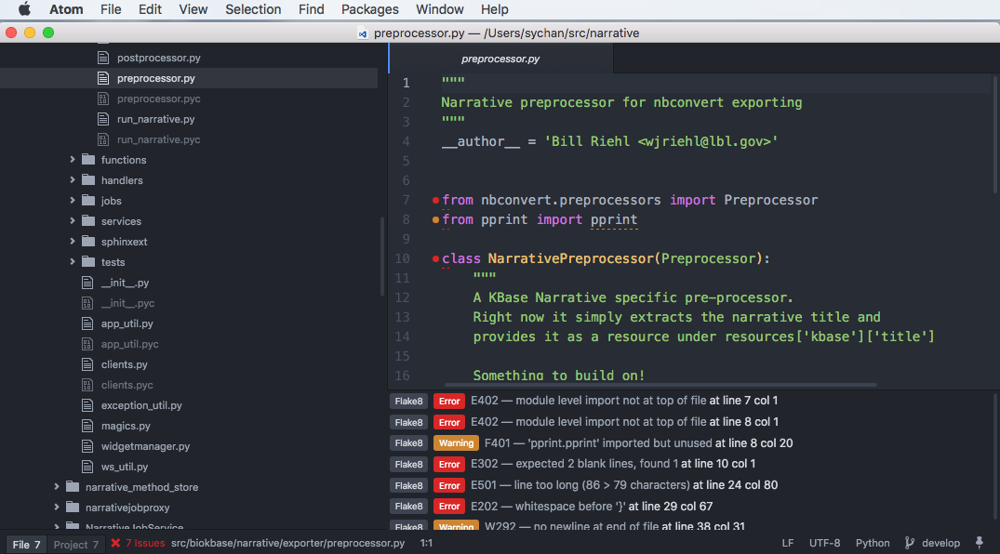
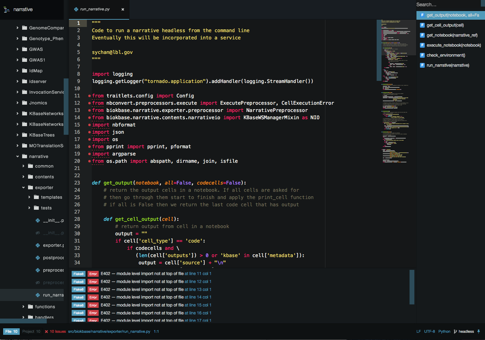
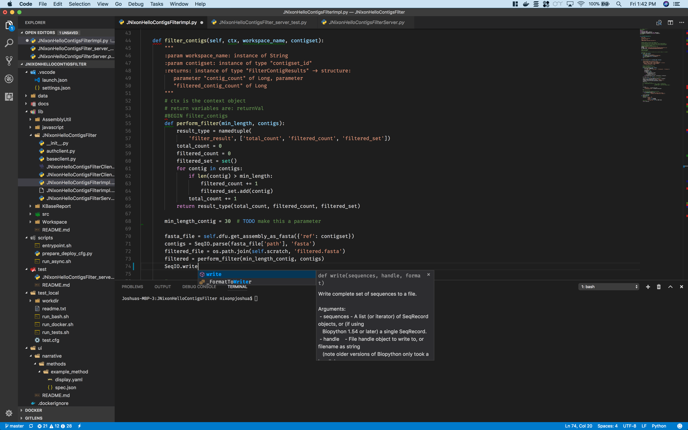

# Recommended Editors and Style Guides

Developer productivity and code quality can be improved by using of an IDE
(Integrated Development Environment). For developers who are not invested in
an existing IDE, this document covers a few options that emacs, vi, textedit,
etc... developers would benefit from investigating.

Along with the editors themselves, we discuss recommended plugins to that help
developers with style checking and basic static analysis, integration with
Github, autocompletion and similar tools that make development easier and more
pleasant for individual developers, as well as promote best practices across
KBase.

# Coding Style and Static Analysis

This section deals with the coding style standards for various languages. This
is a living document and will expand over time as we discover what works best
for the overall KBase developer community.

## Python

For Python, our standard is Python 2.7.x and the use of flake8 to enforce
[PEP8/pycodestyle](https://www.python.org/dev/peps/pep-0008/) and
[pyflakes](https://pypi.python.org/pypi/pyflakes) on new code. This will require
that developers install the python package flake8 via
[pip](https://pip.readthedocs.io/en/stable/installing/). We also highly
recommend the use of [virtualenv](https://virtualenv.readthedocs.io/en/latest/)
and optionally [virtualendwrap](https://virtualenvwrapper.readthedocs.io/en/latest/).
This article provides an overview of both tools: http://docs.python-guide.org/en/latest/dev/virtualenvs/

If installing pip, you can install flake8 in the "global" environment:
~~~
pip install flake8
~~~
The standard for new code is that flake8 should generate
no warnings or errors - it is not necessary to make legacy code flake8 compliant.

### Flake8 configuration

Flake8 has [configuration files](http://flake8.pycqa.org/en/latest/user/configuration.html)
per user, and per project. Flake8 configurations are distributed with KBase
repos in the flake8 section of
[tox.ini](https://tox.readthedocs.io/en/latest/config.html) files. We use
tox.ini files in projects because tox is used for centralizing configuration of
python code projects including test harnesses. Keeping it in all in a single
file make managing these configurations more manageable.

Flake8 has a small collection of extensions - we make use of the
[putty extension](https://pypi.python.org/pypi/flake8-putty). This enables fine
grained control over how flake8 is applied to different files, and it is used
in the flake8. Install this by:
~~~
pip install flake8-putty
~~~

The only current exception to the base set of flake8 rules is to allow line lengths
up to 100 characters in length. The 80 character limit is something of an
artifact of 80 column terminals, typewriters, etc... however extremely long
lines do make code hard to read, so we allow up to 100 characters.

Here is an example project tox.ini configuration (for the kb_sdk repo) that
extends the allowed line length to 100 characters and tells flake8 to ignore
certain warnings that arise in the generated by KBase type compiler, warnings
about legacy code from before flake8 as well as some irrelevant warnings that
come about from the conventions used in
__init__.py files:
~~~
[flake8]
max-line-length = 100
exclude =
#  src/,
  scripts/*,
  modules/*,
  test/*,
  kbase-extension,
  nbextensions,
  node_modules
putty-ignore =
    src/*/__init__.py : F401,E126
~~~

## Javascript ##

Javascript is a rapidly evolving standard, and luckily there are reasonable
tools. The standard for KBase javascript development is [eslint](http://eslint.org/).
It will be necessary to [install nodejs and npm](https://nodejs.org/en/download/package-manager/)
in order to install eslint. For MacOS users, we recommend using homebrew to
install nodejs/npm.

Once npm is installed, this set of instructions can be run: http://eslint.org/docs/user-guide/getting-started

# Recommended Editors #

We recommend that developers who do not have an investment in other IDEs try to
use either [atom](https://atom.io/) or [Visual Studio Code](https://code.visualstudio.com/).
Both of these editors are free, multi-platform (MacOS, Windows and Linux) and
have strong support for plugins from the community as well as well funded
corporate sponsors (Github and Microsoft). They integrate well with Github
as well as tools for KBase's major language platforms ( Python, Java, JS).
Another option that is well loved by many developers is
[Sublime Text](https://www.sublimetext.com/), however it is not free, and nags
about payment unless it is licensed.

## Atom ##

   Atom is a popular free, open source editor with a large community of
supporters, in addition to it's corporate sponsor, Github. It can be extended
via JS code, as well as having a fairly huge pool of plugins and themes. The
drawback is that it can be slow at times.
   When using Atom, we recommend installing the following plugins:
   * [linter](https://atom.io/packages/linter)
   * [linter-flake8](https://atom.io/packages/linter-flake8) - this linter does not seem to honor per project tox.ini files properly - more info as we work out the details
   * [linter-eslint](https://atom.io/packages/linter-eslint)
   * [git-plus](https://atom.io/packages/git-plus)
   * [minimap](https://atom.io/packages/minimap)
   * [autocomplete-python](https://atom.io/packages/autocomplete-python)
   * [atomic-emacs](https://atom.io/packages/atomic-emacs) (adds familiar keyboard bindings for emacs users)
   * [language-ini](https://atom.io/packages/language-ini)
   * [Symbols-list](https://github.com/kbase/project_guides/blob/master/RecommendedEditors.md) Creates a table on the right side showing all function/method names in the current file

The following themes/ui provide styling similar to the popular Sublime UI:
   * [Seti-UI](https://atom.io/themes/seti-ui)
   * [Monokai-Seti](https://atom.io/themes/monokai-seti)

This screenshot shows the Atom editor window when all of the packages listed above are installed and enabled:

Atom is fairly intuitive, however here are some tutorials:
   * http://flight-manual.atom.io/
   * https://medium.com/@vikram/switching-to-atom-70f18a5848a2#.p815arg9t

And just for hahas:
   * [Jupyter in Atom](https://github.com/jupyter/atom-notebook)

## Visual Studio Code ##

   Visual Studio Code (VS Code) is a free, open source multiplatform code editor
from Microsoft. Compared to Atom, it tends to be faster, but seems to have a
smaller user community. From my initial tests it seems to have more convenient
Github integration, excellent support for Typescript/JS development, but
configuration is handled by editing JSON files which is efficient, but somewhat
lacking usability. VS Code seems to be a good choice for front-end and NodeJS
developers. In many regards, Visual Studio Code has a nicer feature set than
Atom.

   The following extensions are recommended for use with Visual Studio Code and
KBase projects. Install them by using shift-ctrl/cmd-X or the extensions icon
on the left panel.
  * [ESLint](https://marketplace.visualstudio.com/items?itemName=dbaeumer.vscode-eslint)
  * [Python](https://marketplace.visualstudio.com/items?itemName=donjayamanne.python) - this extension properly works with per project tox.ini files, making Visual Studio Code preferable for Python projects

For emacs users, the following extension adds emacs keybindings:
  * [vscode-emacs](https://marketplace.visualstudio.com/items?itemName=hiro-sun.vscode-emacs)

VS Code has a built in Markdown preview - from any markdown file,
pressing ctrl-shift-V ( command-shift-V on Macs) will toggle between markdown
source code and a fully rendered markdown preview.

The standard github support in VS Code seems to work well without additional
extensions.

  Sadly there isn't a minimap extension available for VS Code.

  VS Code has many features built in, these tutorials are a good starting point:

   * https://code.visualstudio.com/docs/editor/codebasics
   * https://code.visualstudio.com/docs/languages/python
   * https://code.visualstudio.com/blogs/2016/02/23/introducing-chrome-debugger-for-vs-code
