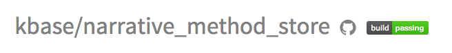

# Setting up Travis-CI and Coveralls for a KBase Github repo
This document will walk through the steps involved in activating Travis-CI for continuous, automated testing, along with Coveralls for reporting code coverage of tests.

[Background and automated testing](#background)  
[Travis-CI initial setup](#travis-init)  
[Travis-CI script configuration](#travis-config)  
[Travis-CI test results](#travis-results)  
[Coveralls initial setup](#coveralls-init)  
[Coveralls configuration](#coveralls-config)  
[KBase Challenges](#kbase-challenges)  

## <a name="background"></a>Background and automated testing

Using Github gives us numerous tools to help with automatic unit testing of open source projects. [Travis-CI](https://travis-ci.org) automatically downloads and tests your repo, returning whether or not all tests pass. If you tests output a .coverage file (see [below](#coveralls-config)), that can be automatically passed to [Coveralls](https://coveralls.io/) where the amount of code tested can be reported in your repo.

These tools are intended to help developers build better code. On each pull request, it becomes easy to see if tests fail or pass, adding to the safety of merging in changes. They also give us a handy benchmark of how deeply tested our code is.

This document will walk through the steps involved in setting up a Github repository to do automated testing and test coverage using Travis-CI and Coveralls. There are a plethora of tutorials out on the internet to help with this, but having a document for KBase will help us by adding test patterns and standards for the use of common dependencies.

**Note that going through the initial setup steps requires having administrative privileges on a repository.**

## <a name="travis-init"></a>Travis-CI initial setup
Most of the below is covered in Travis-CI's ["Getting Started" guide](http://docs.travis-ci.com/user/getting-started/).

1. Go to https://travis-ci.org and sign in through your Github account. Github will ask you for permission to share your information with them, including organization membership. This is totally safe - it lets Travis-CI see what repos you can activate.
2. Click the [+] button on the left next to the "My Repositories" header. This will bring up a list of all repositories that you can activate.
3. Activate that repo by clicking the gray toggle-slider button. That's it! You can modify settings on particular repos by clicking the gear button next to the activation toggle. By default, a Travis-CI job is run on every pull request and every commit.
4. Add a build badge to the README.md in the root of your repo. Clicking on the repository under the "My Repository" heading will take you to a build status page. In the header of this page is a little badge, as circled in the image below.



Click on that image to get a popup with several options for the link style (in the pulldown menu on the left). Select Markdown, then you can copy and paste that link into your README.md file.

## <a name="travis-config"></a>Travis-CI script configuration

Triggering the automated tests requires a little configuration in your repo. This means creating, in the root of your repo, a YAML-formatted file called `.travis.yml`. Travis-CI has some [very detailed documentation](http://docs.travis-ci.com/) available on how to create these.

The remainder of this section will include examples in a few of the more prominent langauges in the project. At the very least, you need a `language:` line with the project language in all lower case. Follow that with the language itself as a line, and the versions of your language you want to test on proceeding lines.

That's the basics. For each language, however, Travis-CI uses a default mechanism for running the tests. For example, for Perl ([see an example](http://docs.travis-ci.com/user/languages/perl/)), this first searches for a Build.PL file in the repo's root. If it finds one, it runs
```
perl Build.PL && .Build test
```
if not, it looks for a Makefile.PL, and runs it with
```
perl Makefile.PL && make test
```
if neither of those are found, it just runs
```
make test
```

Your .travis.yml file is very configurable. In general, you'll probably use something similar to below - this is taken from the [Narrative Method Specs](https://github.com/kbase/narrative_method_specs) store. That store has a small script invoked from a Makefile that validates the format of each spec file.

```
language: perl

perl:
  - "5.18"

install:
  - cpanm --verbose --notest JSON::RPC::Client
  - cpanm --verbose --notest Exception::Class
  - cpanm --verbose --notest File::Slurp

script: make test

branches:
  only:
  - master
  - staging
  - develop
  - dev
```

The test script is written in Perl, so it sets the language as Perl. The `install:` command runs each proceeding line in order before running anything. Note that this can include a `git clone` line to pull in any dependencies.

The `branches:` command gives a list of which branches to run tests against, and can generate a separate test result for each (default is only master).

Finally, the `script:` command is the command to run to perform the tests, and its output is used to judge whether tests pass. This can be any valid command, though `make test` might be the most common. Tests are judged to have passed only if the script finishes with exit code 0.

There are also the `before_install:`, `before_script:`, and `after_success:`/`after_failure:` commands. These are pretty self-explanatory: they run the connected line at that condition. But more details on how to deeply configure your .travis.yml file are available [in the Travis-CI documentation](http://docs.travis-ci.com/user/build-configuration/).

## <a name="travis-results"></a>Travis-CI test results
When your tests pass, all is well, and you'll see the [build|passing] badge showing up happily in your README.md. If tests fails, though, that'll be replaced with a [build|failed] badge in red. Clicking that badge (pass or fail) will take you to the Travis-CI status page for that repo.

There are a lot of options here. Under the "Current" tab, the main panel will show the most recent commit message, and whether it passed. Below that are rows for each build job (one for each language version you included in your .travis.yml). Clicking on those will open up a view of the console where that job was run, including any STDOUT and STDERR results from running the build and test scripts.

These should help you diagnose what went wrong.

## <a name="coveralls-init"></a>Coveralls initial setup
Setting up Coveralls to run against your repo is not very different from setting up Travis-CI, which should be set up first.

1. Login to https://coveralls.io using your Github account. This will pause for a moment while it looks up which repos you have administrative access to.
2. Click the "Repos" button on the top of the left side menu.
3. Click the "Add Repo" button on the upper right (if present, this might just drop you in to a list of available repos on your first time)
4. Select a repo to activate, and click the toggle switch.
5. Clicking on the 'Details' button that appears after the switch is flipped on will take you - for now - to a page with a little help on configuring your repo to be built against Coveralls, especially with Ruby and Travis-CI pro. You probably don't need this for now.
6. On the top of that page is a banner that includes a similar badge to Travis-CI. Click the "Badge URLs" button and copy the Markdown block to paste in your README.md.

## <a name="coveralls-config"></a>Coveralls configuration
#TODO

## <a name="kbase-challenges"></a>KBase challenges
Although this document outlines the general form of how to set up Github repositories to work with Travis-CI and Coveralls, there are still numerous challenges with automatically unit-testing KBase code. Here's a few to get started:

1. **KBase Runtime / dev_container Environment**
  - KBase modules assume they are checked out from inside the dev_container, which is not a standard setup that is easily compatible with Travis.
  - Dev_container tooling assumes a KBase runtime is installed, whereas Travis sets up an environment where runtime tools are directly installed on the VM.
  - Not feasible to install the full KBase runtime on each test (note this is a similar problem faced by outside developers attempting to contribute code to one repo)
  - We also don’t have a good list of system requirements/dependencies per each repo.  We will need this to setup the Travis environment.
2. **Authentication**
  - Testing authenticated services right now is a challenge because we don’t have test user accounts or a mock Authentication service
  - Travis-CI supports encrypted environment variables and encrypted files, but they are only available to PRs or commits by people with commit privileges.  If tests depend on this (to get username/passwords for test configs), then many if not most pull requests will fail Travis tests defeating much of the purpose of Travis CI.
  - Even if we have KBase test accounts, there is a lot of code that connects directly to Globus to authenticate instead of an internal KBase Auth service.  This code will have to be modified (with configurable urls) to work against an Auth service.
3. **(minor) MySQL and other DB configs for Workspace tests**
  - Workspace tests (possibly others) start and stop MySQL, Mongo databases for tests.  The standard Travis approach is to have them already running when tests start, so there may need to be some additional configs or checks for the test environment when running in Travis, particularly for the current MySQL setup which requires AppArmor for MySQL to be disabled.
4. **Mock or temporary dependent services** We need a way to deal with tests that expect the presence dependent services for unit testing. Auth (as mentioned above) is an example, but data services or other computation services are another. Options may include:
  - Deploying a temporary test service on Travis startup time (in the `before_script:` command, maybe)
  - Maintaining non-production services on ci.kbase.us
  - Building a service mock system that immediately returns calls with expected values. This might be language/environment dependent, though.
  - Either way, the goal should be for a unit test suite to run reasonably quickly and independent of running any other code or too many external dependencies.
